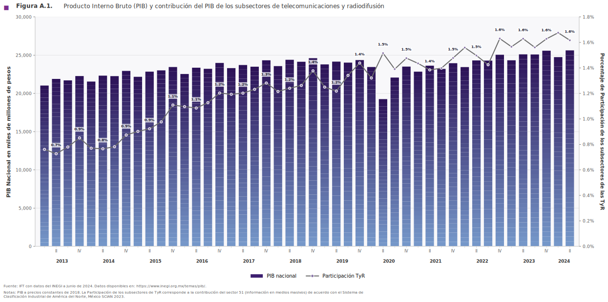
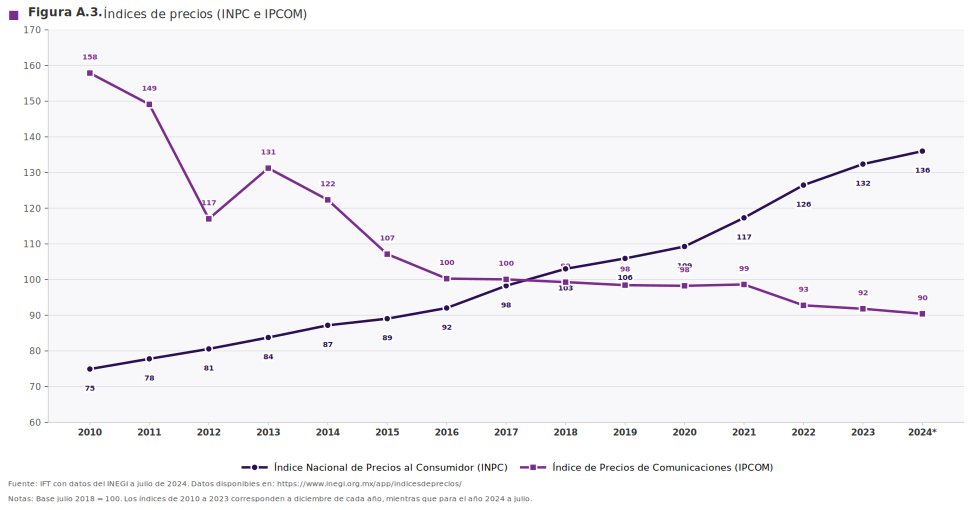
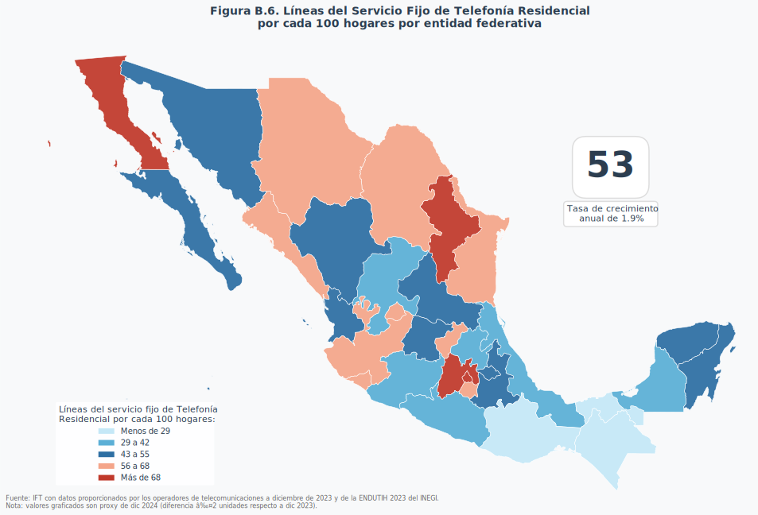
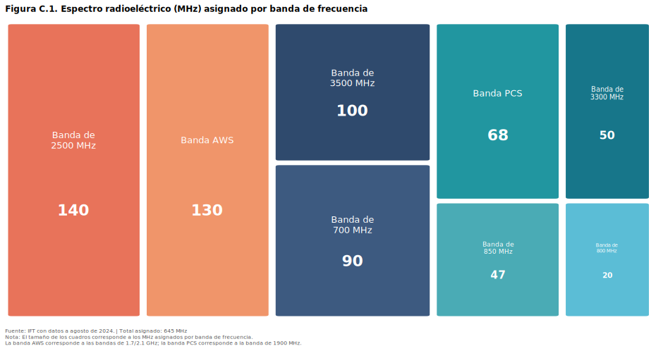
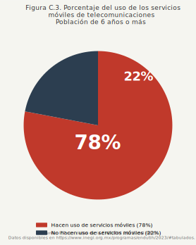
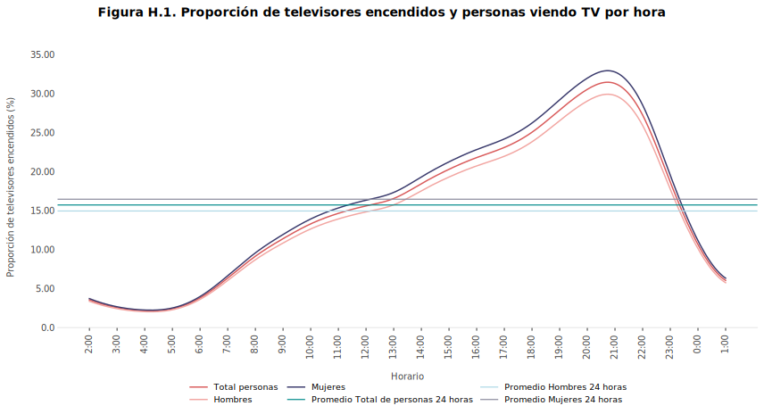
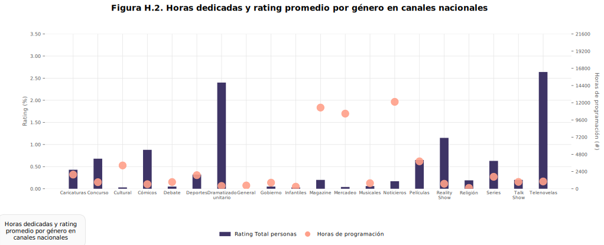

# Galería de Archivos Vectoriales (SVG)

Este directorio alberga las versiones vectorizadas finales de las gráficas. A continuación puedes previsualizarlas directamente en GitHub antes de su inclusión al reporte final.

| Archivo | Vista Previa | Tipo de Gráfica y Herramienta |
|---------|--------------|-------------------------------|
| `Figura_A1.svg` |  | Barras y Líneas (`matplotlib`) |
| `Figura_A3.svg` |  | Líneas / Series de Tiempo (`matplotlib`) |
| `Figura_B6.svg` |  | Mapa Coroplético (`matplotlib`) |
| `Figura_C1.svg` |  | Treemap (`matplotlib`) |
| `Figura_C3.svg` |  | Pastel / Dona (`matplotlib`) |
| `figura_h1.svg` |  | Líneas / Series de Tiempo (`matplotlib`) |
| `figura_h2.svg` |  | Barras y Dispersión (`matplotlib`) |

> **Nota:** Todas las gráficas actuales se generaron utilizando `matplotlib`. Para visualizaciones futuras (como Mapas de México o Treemaps), la expectativa es utilizar `geopandas` o `squarify`, y para barras apiladas `ax.bar(bottom=...)`.
